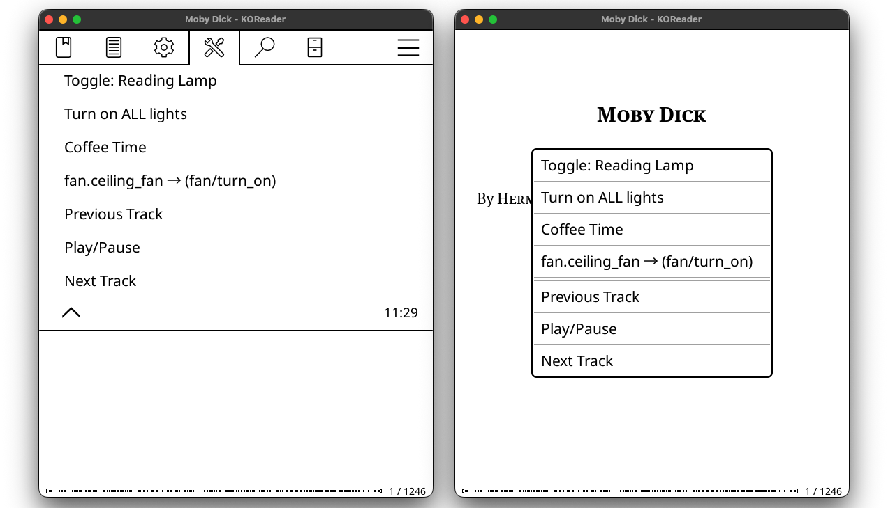
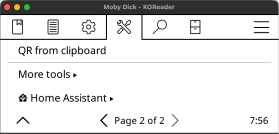
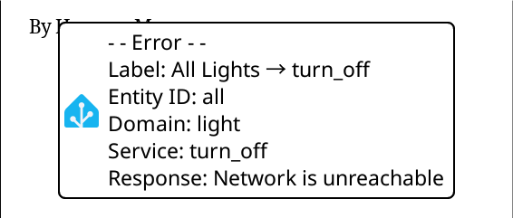
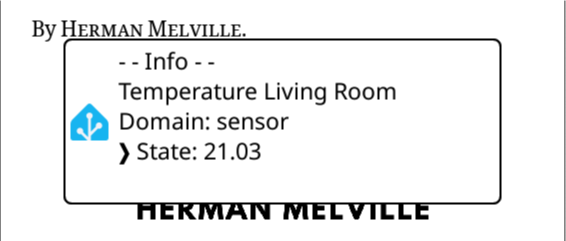

# homeassistant.koplugin

This [KOReader](https://koreader.rocks/) plugin lets you control Home Assistant entities without leaving your current book!

<p align="center">
  Jump to <a href="#getting-started">Getting Started</a>
</p>

<p align="center">

  <i>homeassistant.koplugin: called from Tools menu [left] & as a QuickMenu [right]</i>
</p>

## Features

- Control any number of Home Assistant entities from KOReader 
- Basic service support (e.g. `light/turn_on`, `fan/turn_on` or `media_player/media_play_pause`)  
- Basic entity state support (e.g. `sensor.temperature_outside` or `binary_sensor.front_door`)
- Lightweight, unobtrusive interface  
- Simple text-based configuration  
- Success/error notifications

<br>

## Getting started
### 1. Download the Plugin

Download the latest release and unpack `homeassistant.koplugin.zip`:  
https://github.com/moritz-john/homeassistant.koplugin/releases

### 2. Edit `config.lua`
#### 2.1 Change Connection Settings

```lua {filename="config.lua"}
-- Home Assistant connection settings
host = "192.168.1.10",  -- Change to your Home Assistant IP Address
port = 8123,            -- Default Home Assistant Port
token =                 -- Change to your own Long-Lived Access Token
"PasteYourHomeAssistantLong-LivedAccessTokenHere",
```

>[!tip] 
> How to create a Long-Lived Access Token:   
> [**Home Assistant**](https://my.home-assistant.io/redirect/profile): *Profile → Security (scroll down) → Long-lived access tokens → Create token*  
> _Copy the token now - you won’t be able to view it again._

<br>

#### 2.2 Add your own Home Assistant Entities
##### 2.2.1 Controllable Entities

For each Home Assistant entity you want to control (e.g. `light → toggle`), add an entry with:
```
{
    id = "light.reading_light"   → Entity ID (required)
    service = "toggle"           → Service
    label = "Reading Light"      → Display name (required)
},
```

<details>
<summary>Controll ALL entities of a specifig Home Assistant Domain</summary>

To target every entity in a Home Assistant domain, set:  
1) `id = "all"`  
2) `domain = "<domain_name>"` (required, because "all" has no domain prefix)  
Example:

```
{
    id = "all"
    domain = "light"
    service = "toggle"
    label = "Light Example"
},
```
</details>

##### 2.2.2 Read-Only Entities

If you want to get the [state](https://www.home-assistant.io/docs/configuration/state_object/#about-the-state) of an entitiy omit the `<service>` call.  
Example syntax:

```
{
    id = "sensor.temperature_outside"    → Entity ID (required)
    label = "Show Temperature Outside"   → Display name (required)
},
```

Example entries for Home Assistant entities in `config.lua`:
```lua
{
    id = "all",
    domain = "light",
    service = "turn_off",
    label = "Turn off all lights",
},
{
    id = "light.reading_lamp",
    service = "toggle",
    label = "Reading Lamp → toggle",
},
{
    id = "switch.coffee_machine",
    service = "turn_on",
    label = "♨ Coffee Time",
},
{
    id = "light.living_room",
    label = "Light in living room left on?",
},
{
    id = "binary_sensor.front_door",
    label = "Is the door closed?",
},
[...]
```
_Be aware of proper indentations, `{}` and `,` otherwise you will get syntax errors_

#### Example Actions & Services

Here are common Home Assistant services you can use in `config.lua`:

| Entity Type      | Example Entity ID          | Example Services                                                       |
| :--------------- | :------------------------- | :--------------------------------------------------------------------- |
| **Light**        | light.reading_lamp         | `turn_on` <br> `turn_off` <br> `toggle`                                |
| **Switch**       | switch.outlet_couch        | `turn_on` <br> `turn_off` <br> `toggle`                                |
| **Fan**          | fan.ceiling_fan            | `turn_on` <br> `turn_off` <br> `toggle`                                |
| **Media Player** | media_player.all_speakers  | `media_play_pause` <br> `media_next_track` <br> `media_previous_track` |
| **Scene**        | scene.reading_mood         | `turn_on`                                                              |
| **Automation**   | automation.bed_routine     | `trigger`                                                              |
| **Input Button** | input_button.wake_computer | `press`                                                                |


>[!Note] 
> Only _basic_ services are supported.  
> Additional service data (e.g. `rgb_color`) is not.

### 3. Copy files
After editing `config.lua` copy the entire `homeassistant.koplugin` folder into `koreader/plugins/`.

Copy the `icons` folder to `koreader/`.

### 4. Restart KOReader
The plugin appears under **Tools → Page 2 → Home Assistant**    
or can be called from KOReader gestures.

## Gestures
You can trigger your Home Assistant entities directly through KOReader gestures.  
Each gesture can be assigned to any entity you have configured in `config.lua`.

For any chosen gesture, you will find your entities in  
**General▸ → Pages 1–X [find your Home Assistant entity]**  
The actions will be named after your entity `label`.

A complete gesture example:  
**Settings → Taps and gestures → Gesture manager▸**  
**Long-press on corner▸ → Bottom Left → General▸ → Page 1–X: Toggle: Reading Lamp**

### QuickMenu

The simplest way to access your Home Assistant entities is through a [QuickMenu](https://koreader.rocks/user_guide/#L2-quickmenu).

Add as many entities as you want to a gesture (e.g. **Long-press on corner▸ → Bottom Left**)  
and then select **Show as QuickMenu** in **Long-press on corner▸ → Bottom Left → Page 2**.

The result looks like this:

<p align="center">

</p>

## Requirements
- KOReader (tested with: 2025.10 "Ghost" on a Kindle Basic 2024)  
- Home Assistant & a Long-Lived Access Token
- HTTP access (HTTPS currently not supported)

## Screenshots

<p align="center">

</p>

<p align="center">

</p>

<p align="center">

</p>

[homeassistant.koplugin Repository](https://github.com/moritz-john/homeassistant.koplugin)  
[KOReader Website](https://koreader.rocks/)

[Home Assistant: REST API](https://developers.home-assistant.io/docs/api/rest/)  
[Home Assistant: Services](https://data.home-assistant.io/docs/services/)  
[Home Assistant: Performing actions](https://www.home-assistant.io/docs/scripts/perform-actions/)


